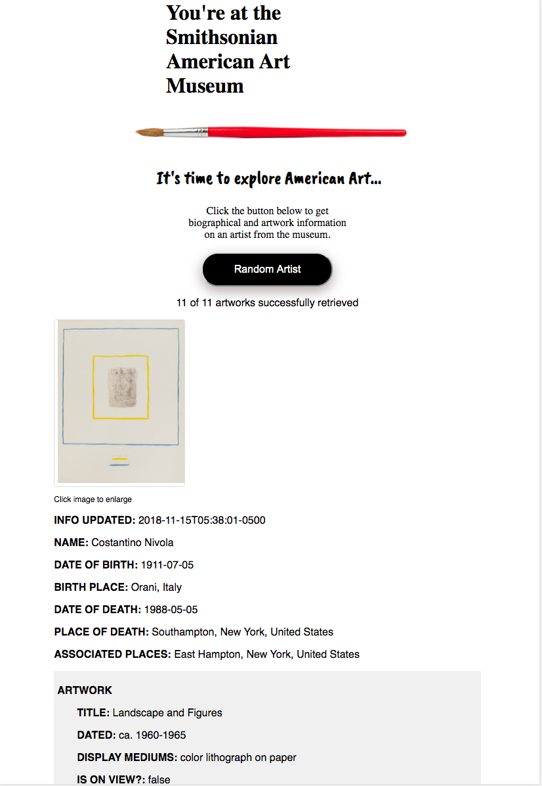

# APP NAME:
Search the SAAM (Smithsonian American Art Museum)

# TO RUN:
To run the app, go to https://cpedersen.github.io/smithsonian-art/

# SUMMARY:
This is an app intended to help explore art at the Smithsonian American Art Museum (SAAM). The user can randomly generate artist information as a vehicle for exploring both American art and art at the museum. 

Click on the Random Artist button to display a sample of the artist's work, along with biographical information and details about the artwork owned by the museum. You can find out whether the artwork is on display and how the museum acquired the art, among other things.

# DATA: 
A sample data set is provided.

# TECHNOLOGY USED:
HTML, CSS, JavaScript, and jQuery

# SCREENCAPTURE:
After selecting the Random Artist button, you should see content such as the following:

